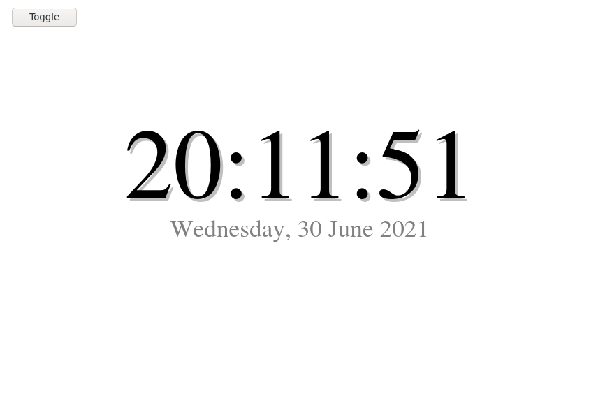

# WebBasicClock

I was surprised to find that Microsoft Windows 10 doesn't bundle a clock that can be opened fullscreen. So I wrote this to serve that purpose in the future, if the need arises. (On my own Unix computers, I could just open Xclock or something.)

This "application" is small, so it's in one HTML file. The analog clock should be easy to port given that it uses only graphic primitives. To run it, just download the HTML file and open.

The digital clock was the first written, and is basically the fields of JavaScript's date object wrapped in some CSS.

The analog clock is similar to Windows 1.0's (which was, technically, used as reference). Rather than straight hands and labeled hours typical of most clocks, the hands are unfilled polygons, and the hours are merely represented as solid boxes to contrast with the small minutes.
